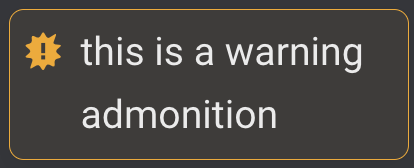
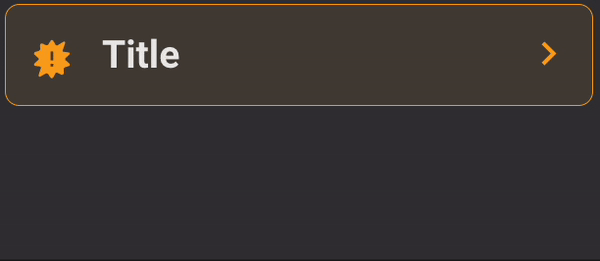
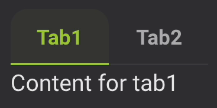

# ACCESS-Hive
[][website]
[][github-repo]
[][forum]
[](https://github.com/ACCESS-NRI/access-hive.org.au/actions/workflows/link_check.yml)

This repository is the implementation of the ACCESS-Hive website accessible at the following URL:<br>
https://access-hive.org.au/

ACCESS-Hive is the documentation hub for the Earth System models, ACCESS, and their community.

# How to Contribute
If you wish to add documentation to the ACCESS-Hive website check the [contribution guide](https://access-hive.org.au/about/contribute/) for instructions.

## Styling guidelines for developers
The ACCESS-Hive website is built using [Material for MkDocs](https://squidfunk.github.io/mkdocs-material/). For detailed information on markdown syntax and different features, please refer to [mkdocs-material documentation](https://squidfunk.github.io/mkdocs-material/reference/).

For a detailed guide on Mk
Please follow the guidelines below to make the Hive consistent among all the pages contributed by different people. 

- Always prefer Markdown syntax to HTML when possible;
- Titles/subtitles should NOT include: code lines/blocks, bold (titles are usually already bold), italic, links;
- Code lines/blocks need to be used for lines/blocks of code, terminal commands and file/directory paths/names;
- Italic needs to be used when referring to specific proper nouns (for example _Gadi_ or _payu_);
- Bold can be used to highlight some words (please do not overuse it);
- All types of admonitions (info, warning, etc.), collapsible and not, can be used as described in the [documentation](https://squidfunk.github.io/mkdocs-material/reference/admonitions/), but they are rendered slightly differently. For the HTML version of them, please refer to the [HTML/Markdown cheatsheet](#HTML/markdown-cheatsheet).
- Instructions for different versions (for example different operative systems or different model versions) can be rendered using tabs (see [HTML/Markdown cheatsheet](#HTML/markdown-cheatsheet));

### Styling Markdown using CSS
#### Attribute lists
To style Markdown using custom CSS, you can use [attribute lists](https://python-markdown.github.io/extensions/attr_list/#limitations) by adding the desired CSS style (in-line or adding classes as defined in the `access-nri.css` file) inside curly brackets (starting with a comma) right after the markdown syntax.

For example, to make an image 50%-wide and with rounded borders, you can write the following:
```
{: style="width: 50%; border-radius: 0.6rem;" }
```
#### Markdown in HTML
You can use [Markdown in HTML](https://squidfunk.github.io/mkdocs-material/setup/extensions/python-markdown/?h=md+in+html#markdown-in-html) by adding the `markdown` attribute inside an HTML tag.<br>You can then style the HTML tag using CSS (in-line or adding selectors to the `access-nri.css` file).

For example, to render a markdown section with half font-size, you can write the following:
```
<div markdown style="font-size: 0.5em;">
### Section with half font-size (This will appear in the table of content)

- First _bullet_ point
- Second bullet **point**
</div>
```

### HTML/Markdown Cheatsheet for the Hive
|Style|Markdown Syntax|HTML Syntax|Rendered example|
|---|---|---|---|
|**Bold**|\*\*bold**|\<b>bold\</b>|**bold**|
|**Italic**|\_italic_|\<i>italic\</i>|_italic_|
|**Code line**|\`code line`|\<code>code line\</code>|`code line`|
|**Code block**|\```<br>&emsp;code block<br>```|\<pre><br>&emsp;\<code>code block\</code><br>\</pre>|<pre><code>code block</code></pre>|
|**[Admonition](https://squidfunk.github.io/mkdocs-material/reference/admonitions/#usage) (not collapsible)**|!!! warning<br>&emsp;this is a warning<br>&emsp;admonition|\<div class="admonition warning"><br>&emsp;this is a warning<br>&emsp;admonition<br>\<div>||
|**Collapsible [Admonition](https://squidfunk.github.io/mkdocs-material/reference/admonitions/#usage)**|??? warning title<br>&emsp;this is a collapsible<br>&emsp;warning admonition|\<details class="warning"><br>&emsp;\<summary><br>&emsp;&emsp;\<p><br>&emsp;&emsp;&emsp;this is a collapsible<br>&emsp;&emsp;&emsp;warning admonition<br>&emsp;&emsp;\</p><br>&emsp;\</summary><br>\</details>||
|**Tabs**|N/A|\<div class="tabLabels" label="your-tab-label"><br>&emsp;\<button>Tab1\</button><br>&emsp;\<button>Tab2\</button><br>\</div><br>\<div class="tabContents" label="your-tab-label"><br>&emsp;\<div><br>&emsp;&emsp;Content for tab1<br>&emsp;\</div><br>&emsp;\<div><br>&emsp;&emsp;Content for tab2<br>&emsp;\</div><br>\</div>||


# License
The ACCESS-Hive site is covered by the [CC-BY 4.0 license](https://creativecommons.org/licenses/by/4.0/legalcode).

However, the material linked to from ACCESS-Hive is covered by various licensing agreements. Our users should directly refer to the terms and conditions of any material they are using to understand their rights and responsibilities.

[website]: https://access-hive.org.au
[github-repo]: https://github.com/ACCESS-Hive/access-hive.github.io.git
[forum]: https://forum.access-hive.org.au