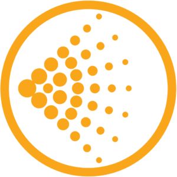

# Aerosol and Chemistry Components

The atmospheric composition capabilities in ACCESS are built on ACCESS-CM2. ACCESS-CM2 includes the sophisticated GLOMAP aerosol scheme, and an extended configuration that simulates atmospheric chemistry from the surface to the stratosphere (ACCESS-CM2-Chem). Many elements of the Earth system are connected via atmospheric composition.

## Aerosol

{align=right width=300}
An aerosol is a population of small particles suspended in the atmosphere. These particles influence clouds and precipitation, and play an important role in the Earth’s energy balance.

The aerosol scheme in ACCESS-CM2 is called the GLObal Model of Aerosol Processes (GLOMAP), and simulates the life cycle of aerosol from source to deposition, including the impacts on clouds and energy budget. GLOMAP includes a highly detailed representation of aerosol characteristics, allowing simulation of aerosol number, size, and concentrations of individual components such as sulphate, different types of carbon, and sea salt.

## Chemistry

{align=right width=300}
ACCESS-CM2-Chem is an extended version of ACCESS-CM2 containing a representation of atmospheric chemistry. The chemistry component includes reactions relevant in the troposphere (to simulate greenhouse gases such as ozone and methane) and the stratosphere (to simulate ozone depleting substances and the ozone hole).

How are the atmospheric composition components used?
Inclusion of the aerosol and (optionally) chemistry components enables ACCESS to simulate the impact of changing atmospheric composition on climate, and opens up the possibility of resolving feedbacks between other components of the earth system. Studies using the atmospheric composition components have been conducted into the tropospheric ozone budget, the stratospheric ozone hole, marine aerosol and clouds, and biomass burning.

ACCESS-CM2(-Chem) can be configured to run with or without a coupled ocean, and can be ‘nudged’ to observed meteorology to reproduce the weather patterns during a particular time period. The nudging capability makes ACCESS-CM2(-Chem) a powerful tool to undertake aerosol and chemistry process studies around research voyages and field campaigns.

