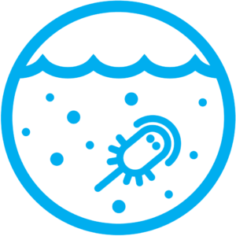

# Biogeochemistry Model Component – Ocean (WOMBAT)

{align=right width=300}

WOMBAT is the ocean carbon model (World Ocean Model of Biogeochemistry And Trophic-dynamics), developed in Australia. It calculates the carbon fluxes of the ocean, by simulating the evolution of phosphate, oxygen, dissolved inorganic carbon, alkalinity and iron with one class of phytoplankton and zooplankton.

WOMBAT is a Nutrient, Phytoplankton, Zooplankton and Detritus (NPZD) model, with one zooplankton and one phytoplankton class.

**How is WOMBAT used?**

In ACCESS, this model is added to the ocean model (MOM) using a coupler. This is then added to the Earth System Model (ESM1.5) to produce the simulations used at the Climate Model Intercomparison Project (CIMP).