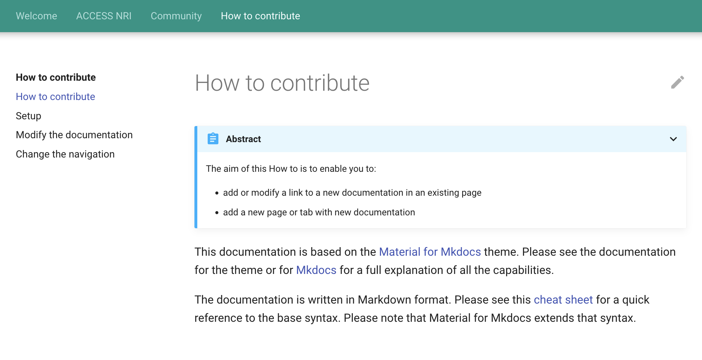

# Change the navigation

## Structure of the repository

The important elements of the repository to know about before modifying the navigation are:

 - `docs/` folder: this folder contains all the documentation pages. There is an `index.md` file for the About page, one folder per tab on the site, an `assets/` folder to store images used in the documentation and some customisation folders such as `css/` or `font/`.
 - [`mkdocs.yml`][mkdocsYML]: it is a YAML formatted file, hence the `.yml` extension. The site navigation is defined in this file as well as options for the styling of the site. 

???+ info "YAML"
    YAML is a popular choice for configuration files, as it is a simple way of encoding data structures in a text file. See this [short tutorial][YAMLtutorial].

## A simple example

The easiest way to explain how the navigation is defined is to look at an example. Let's say `mkdocs.yml` contains:

```yaml
nav:
  - Welcome: index.md
  - ACCESS-NRI: ACCESS-NRI/ACCESS-NRI.md
  - Community: 
    - Generate Bathymetry: community/bathymetry.md
  - How to contribute: 
    - How to contribute: help/how_to_contribute.md
    - Setup: help/contribution_setup.md
    - Modify the documentation: help/modify_documentation.md
    - Change the navigation: help/change_navigation.md
```

The top level category names define the tabs in the header bar. So here we have the tabs: "Welcome", "ACCESS-NRI", "Community" and "How to contribute". It also defines the name of the top section under each tab.


The second level of categories indicate the name of each page under that section. So the "ACCESS-NRI" tab has the text directly under the section "ACCESS-NRI". The "Community" tab has a section called "Community" that contains one page: "Generate Bathymetry". Finally, the "How to contribute" tab has 1 section "How to contribute" with 4 pages.

The filenames indicate the path to the file relative to the `docs/` folder containing the text for each page. It is recommended to use the title of each file (i.e. the Header 1) as the name of the page and the filename.



## Add sections to a tab

It is possible to define several sections per tab by using more levels of indentation. For example, to add a "My example" section to the "How to contribute" tab:

```yaml
nav:
  - Welcome: index.md
  - ACCESS-NRI: ACCESS-NRI/ACCESS-NRI.md
  - Community: 
    - Generate Bathymetry: community/bathymetry.md
  - How to contribute: 
    - How to contribute: help/how_to_contribute.md
    - Setup: help/contribution_setup.md
    - Modify the documentation: help/modify_documentation.md
    - Change the navigation: help/change_navigation.md
    - My example:
        - Beautiful example: help/beautiful_example.md
```
will create this navigation:


[mkdocsYML]: https://github.com/ACCESS-Hive/website/blob/main/mkdocs.yml
[YAMLtutorial]: https://kopi.dev/yaml-tutorial-beginner/
