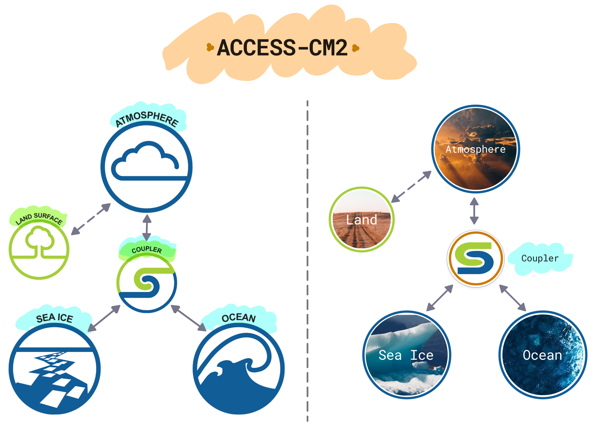

# 
 ACCESS-CM {{ supported }} 

ACCESS-CM2 (ACCESS Coupled Model 2) is a global fully-coupled climate model that includes the atmosphere, ocean and sea-ice components, and produces physical climate simulations. ACCESS-CM2 is one of the two models run by the Australian climate community for the 
<a href = "https://www.wcrp-climate.org/wgcm-cmip" target="_blank"> Coupled Model Intercomparison Project, CMIP</a>.
 

{width=100%}

## ACCESS-CM2 configurations

- Atmosphere model (UM10.6): N96 resolution (1.875° x 1.25°, 85 levels). Physical model only – no carbon cycle.

- Land surface model (CABLE2.5) 

- Ocean model (MOM5): Tripolar grid, 1° resolution, 50 levels.

- Sea ice model (CICE5.1) 

    | COMPONENT     | MODEL         | VERSION               |
    | ------------- | ------------- | --------------------- |
    | Atmosphere    | UM            | 10.6                  |
    | Land Surface  | CABLE         | 2.5 (integrated in UM)|
    | Ocean         | MOM	        | 5                     |
    | Sea Ice       | CICE          | 5.1                   |
    | Coupler       | OASIS-MCT     | 3                     |

ACCESS-NRI will release an ACCESS-CM model configuration. The first release of ACCESS-CM will be derived from the [CSIRO ACCESS-CM2 configuration](#access-cm2) and will include [atmosphere], [land], [ocean] and [sea ice] components.

## 
 [ACCESS-CM2] {{ recommended }} 

[**Citation** [@Bi2020-vj]][ACCESS-CM2-cite] |
[**Tutorial**][ACCESS-CM2-tute]

ACCESS-CM2 [@Bi2020-vj] is one of Australia’s contributions to the World Climate Research Programme’s Coupled Model Intercomparison Project Phase 6 (CMIP6). The component models are: UM10.6 GA7.1 for the atmosphere, CABLE2.5 for the land surface, MOM5 for the ocean, and CICE5.1.2 for the sea ice. Compared to previous model versions ACCESS-CM2 shows better global hydrological balance, more realistic ocean water properties (in terms of spatial distribution) and meridional overturning circulation in the Southern Ocean but a poorer simulation of the Antarctic sea ice and a larger energy imbalance at the top of atmosphere. This energy imbalance reflects a noticeable warming trend of the global ocean over the spin-up period.

[atmosphere]: ../model_components/atmosphere.md
[land]: ../model_components/land.md
[ocean]: ../model_components/ocean.md
[sea ice]: ../model_components/sea-ice.md

[ACCESS-CM2]: https://research.csiro.au/access/about/cm2/
[ACCESS-CM2-cite]: https://www.publish.csiro.au/es/ES19040
[ACCESS-CM2-tute]: https://nespclimate.com.au/wp-content/uploads/2020/10/Instruction-document-Getting_started_with_ACCESS.pdf

<!--  -->
