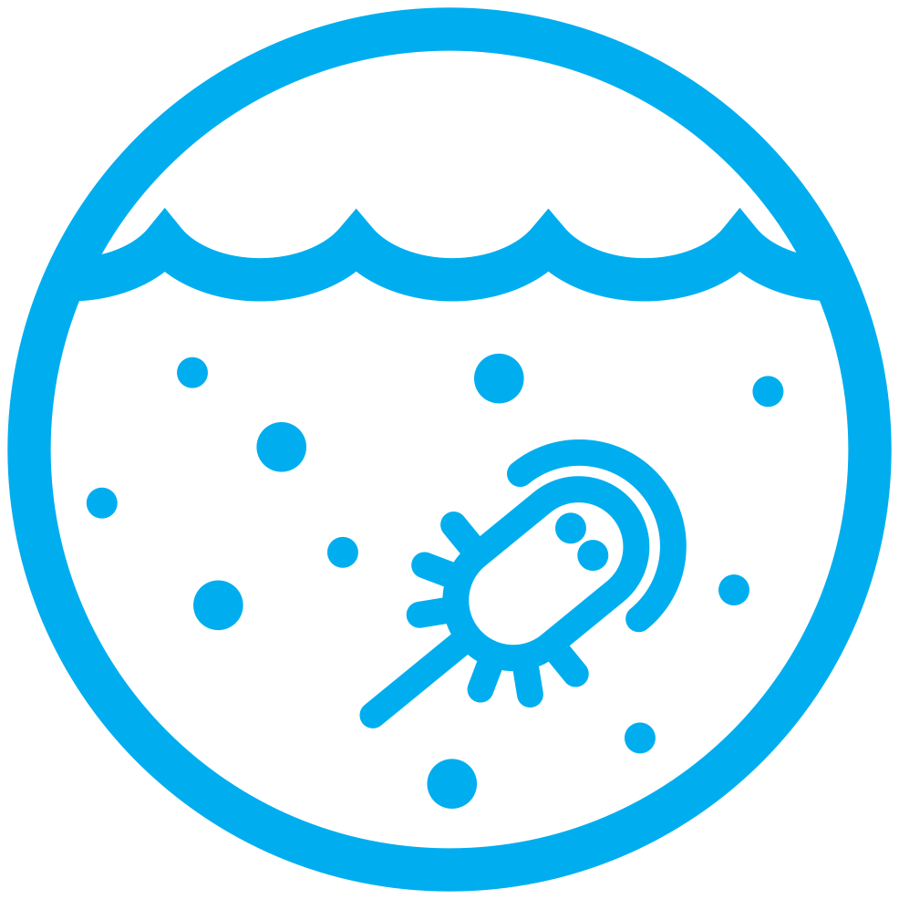

# 
 Biogeochemistry Ocean 

<!--  -->

<!-- {align=right width=40%} -->

</img>

## 
 [WOMBAT][MOM5-WOMBAT-code] {{ supported }} 

The World Ocean Model of Biogeochemistry And Trophic-dynamics ([WOMBAT][MOM5-WOMBAT-code]) is the ocean carbon module added to [MOM][mom-wiki] ocean model. Developed in Australia, WOMBAT calculates the carbon fluxes of the ocean by simulating the evolution of phosphate, oxygen, dissolved inorganic carbon, alkalinity and iron with one class of phytoplankton and zooplankton.

### How is WOMBAT used?

WOMBAT is applied as a Nutrient, Phytoplankton, Zooplankton and Detritus (NPZD) tracer package in the [MOM5][MOM5-WOMBAT-code] ocean model of the ACCESS-OM2 and ACCESS-ESM1.5 configurations.

[MOM5-WOMBAT-code]: https://github.com/COSIMA/ACCESS-ESM1.5-MOM5
[mom-wiki]: https://mom-ocean.github.io/